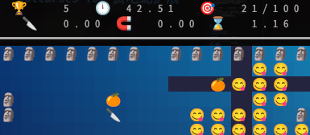

# Emoji 貪吃蛇遊戲

[](https://opensource.org/licenses/Apache-2.0)
[](https://en.cppreference.com/w/c/23)


`emoji_snackgame` 是一個基於 [Notcurses](https://github.com/dankamongmen/notcurses) 的 TUI 貪吃蛇遊戲擴展庫。它允許您在任何全屏運行的 Notcurses 程序中快速集成可交互的貪吃蛇遊戲平面。


🇬🇧 [English](README.md) | 🇨🇳 [中文](README_ZH.md) | 🇨🇳 [简中](README_ZH_CN.md) 
|------|------|------|
🇵🇹 [Português](README_PT.md) | 🇷🇺 [Русский](README_RU.md) | 🇪🇸 [Español](README_ES.md)

## 🌟 核心特性

- 🎮 多線程，想要開啟多少個遊戲就開啟多少個 snake 平面。
- 🎵 即時音效支持，(使用 SDL2_mixer)
- 🕹️ 更多遊戲性，相較於原版貪吃蛇遊戲有更高遊戲性。貪吃蛇擁有道具，技能。
- 🎨 Emoji 圖形（需終端支持字體）

## 🎮 遊戲概覽


你正身處一個五彩繽紛的 Emoji 世界，作為可愛的 Emoji 蛇 😋，將展開一段精彩刺激的探險之旅！你的目標是在規定時間內，成功收集足夠多的美味橙子 🍊，並戰勝沿途的各種障礙挑戰。這個神奇的迷宮裡充滿了驚喜與樂趣，一起來玩耍吧，相信你一定能成功完成這次冒險。

在指定時間 🕛 內獲取足夠多的橙子 '🍊' 得分，在達成目標後 🎯，遊戲便會勝利，否則由各種原因造成角色死亡（包括倒計時結束），遊戲便會失敗。

## 💥 豐富多彩的道具系統

### 🔪 破壞神：你的可怕武器！
這個厲害的道具可以轟隆隆地摧毀那些擋路的牆壁，為你開闢全新的通道。每當你成功破壞 5 面牆壁，就會獲得額外的分數獎勵哦！當你獲取到 Debuff 能力時候，如果立即獲取 '🔪' 則會重置角色到正常。不過要小心，因為討厭的燃燒番茄 🍅 竟然還能限制你的破壞能力。燃燒番茄 🍅 會抑制破壞神能力，並獲得超凡移動速度 🤯，為了達成目標，你能否在速度和破壞之間做取捨？

### ⌛ 時光沙漏：掌控時間的奇妙法寶
只要按下 `k` 鍵或 `空格`，你就能暫停時間，甚至回溯過去！這樣就能輕鬆應對各種危機，不過那些討厭的蘑菇 🍄 可是會破壞你的時間掌控能力，'🍄' 會讓角色減慢速度，但不會特別慢，同時角色操作方向被打亂 😱，狀態欄被禁用，在一定時間後，角色會突然恢復原來速度，並且方向回復，你能否反映過來呢？

### 🧲 吸鐵石：得分的神奇加速器
最厲害的是它不僅能大幅提高你的得分，還能幫你刷新道具！而且不管你拾取什麼道具，它都會給你加分。唯一麻煩的就是那個討厭的蟲子 🐛 出現時，可能會打擾到你。'🐛' 在你拾取食品都會噁心 🤮，而當你處於 🧲 狀態，拾取任何道具或食物都會扣分。

## 🎯 遊戲目標
在規定時間內成功收集足夠的橙子 🍊，否則遊戲失敗。

## 🕹️ 操作指南
- 使用 `WASD` 或方向鍵移動
- 按 `k` 鍵或 `空格` 激發時停能力 
- 點擊 `Tab` 或 `回車` 暫停遊戲
- 按 `Esc` 退出遊戲

## 🧩 障礙與挑戰
那些可怕的石頭雕塑 🗿 簡直就是一大麻煩，不過只要你拿到了破壞神的力量，它們就會變成易毀的土豆 🥔 了！在制定時間內抓緊時間破壞它們把！否則你會被牆壁困住，一上去就 gameover 了。

## 🚀 啟動方式
在支持 Emoji 的終端裡輸入下面的命令就能開始玩了。
```bash
emoji-snakegame n
```
n 是關卡的編號。

## 📦 安裝指南
#### 編譯建議

- **GCC 9+**
- **std=c11+**
- **redhat 系 Linux 系統**
- **Debian 系 Linux 系統**

| 安裝內容    | 安裝路徑                                |
| ----------- | --------------------------------------- |
| 可執行文件  | /usr/bin/emoji_snakegame                |
| 動態/靜態庫 | /usr/local/lib/libnotcurses-snake**     |
| 頭文件      | /usr/local/include/notcurses-snake.h    |
| 音效資源    | /usr/local/share/notcurses-snake-sounds |

### 從源碼構建
```bash
# 解壓並進入項目目錄
tar -xvf emoji-snake.tar.xz
cd emoji-snake

# 初始化構建環境安裝軟件包（自動檢測 APT/DNF）
bash setup-dev-env.sh

# 編譯及安裝
sudo make && sudo make install

# 驗證安裝
emoji_snackgame v
```

### 卸載
```bash
sudo make uninstall
```

# 編譯鏈接 snake 到你的 TUI 程序
下面幾個內容將告訴你如何使用 libnotcurses-snake 鏈接庫進行嵌入式遊戲到你的 TUI 程序。

## 🛠️ 快速集成

### 示例
```c
#include <notcurses-snake.h>
#include <notcurses/notcurses.h>

int main()
{
    // 初始化 Notcurses
    struct notcurses *nc = notcurses_init(NULL, stdout);
    struct ncplane *plane = notcurses_stdplane(nc);

    // 配置遊戲參數
    struct SnakeOpt snakeOpt = {
        .snakeNcplane = plane,
        .width = 60,      // 地圖寬度，同理，寬字符串導致實際上寬度需要 60*2=160
        .height = 30,     // 地圖高度，注意你需要保證平面會至少預留 3 行空間給平面狀態欄。實際渲染高度為 30+3+1=34。
        .fade = true,     // 啟用地圖染色漸變效果
        .level = 1,       // 初始關卡
        .isMusicOn = true // 啟用背景音樂，啟用背景音樂只有一個 snake 可以啟用音樂。
    };

    // 初始化遊戲引擎
    struct SnakeState *game = SnakeGameInit(nc, &snakeOpt);
    // 用於防抖的時間戳變量用於防抖
    long long last_key_timestamp = 0;
    // 主遊戲循環
    while (SnakeGameIsRunning(game))
    {
        struct ncinput ni;
        if (notcurses_get_nblock(nc, &ni))
        {
            // 輸入防抖處理，使得菜單選項不會重複輸入，你也可以用到其他地方
            bool allow_input = SnakeInputDebounceControl(
                &last_key_timestamp,
                50000LL);

            if (allow_input && ni.id == NCKEY_ENTER || ni.id == NCKEY_TAB)
            {
                SnakeGameTryPause(game);
            }
            else if (allow_input && ni.id == NCKEY_ESC)
            {
                snakeGameExit(game);
            }

            else
            {
                SnakeGameInput(game, ni); // 注意 SnakeGameInput 自帶防抖，不需要額外機制讓他延遲。
            }
        }

        // 渲染邏輯
        if (SnakeGameShouldRender(game))
        {
            notcurses_render(nc);
            SnakeGameUnlockRender(game);
        }

        usleep(50000); // 50ms 刷新週期
    }

    // 清理資源
    SnakeGameAllClean();
    notcurses_stop(nc);
    return 0;
}
```

## 🎮 自定義功能

### 自定義音效
```c
    // 配置遊戲參數時候
    struct SnakeOpt snakeOpt = {
        .snakeNcplane = plane,
        .width = 60,      // 地圖寬度，同理，寬字符串導致實際上寬度需要 60*2=160
        .height = 30,     // 地圖高度，注意你需要保證平面會至少預留 3 行空間給平面狀態欄。實際渲染高度為 30+3+1=34。
        .fade = true,     // 啟用地圖染色漸變效果
        .level = 1,       // 初始關卡
        .isMusicOn = true // 啟用背景音樂，啟用背景音樂只有一個 snake 可以啟用音樂。
    };
    strcpy(opts.musicPath, "/path/to/custom_sounds"); // 你可以自定義音效目錄，之後遊戲內部的音樂都是在這個目錄內。如果你填寫的是相對目錄，將是相對於程序目錄。
```

### 更多：

[創建多個遊戲平面](TEST/TestDynamic/test.c)

[頭文件定義](src/notcurses-snake.h)

## 🔧 編譯基礎命令建議

```makefile
# 使用靜態鏈接庫，需要鏈接 SDL2，指定靜態庫用 -Wl,--whole-archive -l:libnotcurses-snake.a 制定，動態庫用 -Wl,--no-whole-archive 制定，至少包含 -lnotcurses -lnotcurses-core -lSDL2 -lSDL2_mixer
gcc -std=c2x -D_XOPEN_SOURCE=600 -D_GNU_SOURCE \
test.c \
-Wl,--whole-archive -l:libnotcurses-snake.a \
-Wl,--no-whole-archive -lnotcurses -lnotcurses-core -lSDL2 -lSDL2_mixer \
-o test

# 使用動態鏈接庫，軟件體積更小
gcc test.c -o test \
    -lnotcurses-snake \
    -lnotcurses \
    -lnotcurses-core \
    -D_XOPEN_SOURCE=600 \
    -D_GNU_SOURCE \
    -std=c23
```

## ⚠️ 已知終端兼容性問題

| 終端環境        | 支持狀態 | 特殊置                                                                |
| --------------- | -------- | -------------------------------------------------------------------- |
| **Kitty**       | ✅ 最佳   | 顯卡加速終端，你必須手動啟用防抖動，如 `SnakeInputDebounceControl` 函數 |
| VSCode 內置終端 | ❌ 不兼容 | 1.85.3 及以上版本，notcurses 不兼容; 1.85.2 及以下版本，notcurses 不兼容 |

[更多](https://github.com/dankamongmen/notcurses/blob/master/TERMINALS.md)

## 📜 協議說明

本項目採用 [Apache License 2.0](https://www.apache.org/licenses/LICENSE-2.0)。