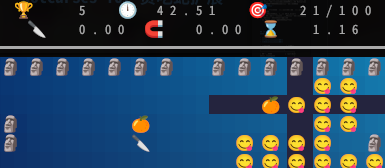

# Emoji SnakeGame

[](https://opensource.org/licenses/Apache-2.0)
[](https://en.cppreference.com/w/c/23)


`emoji_snackgame` 是一个基于 [Notcurses](https://github.com/dankamongmen/notcurses) 的 TUI 贪吃蛇游戏扩展库。它允许您在任何以全屏运行的 Notcurses 程序中快速集成可交互的贪吃蛇游戏平面。

🇬🇧 [English](README.md) | 🇨🇳 [中文](README_ZH.md) | 🇨🇳 [简中](README_ZH_CN.md) 
|------|------|------|
🇵🇹 [Português](README_PT.md) | 🇷🇺 [Русский](README_RU.md) | 🇪🇸 [Español](README_ES.md)

## 🌟 核心特性

- 🎮 多线程，想要开启多少个游戏就开启多少个snake平面.
- 🎵 实时音效支持, (使用 SDL2_mixer)
- 🕹️ 更多游戏性，相较于原版贪吃蛇游戏有更高游戏性。贪吃蛇拥有道具，技能。
- 🎨 Emoji 图形 (需终端支持字体)


## 🎮 游戏概览



你正身处一个五彩缤纷的Emoji世界,作为可爱的Emoji蛇 😋,将展开一段精彩刺激的探险之旅!你的目标是在规定时间内,成功收集足够多的美味橙子 🍊,并战胜沿途的各种障碍挑战。这个神奇的迷宫里充满了惊喜与乐趣,一起来玩耍吧,相信你一定能成功完成这次冒险。

在指定时间🕛内获取足够多的橙子'🍊'得分,在达成目标后 🎯，游戏便会胜利,否则由各种原因造成角色死亡（包括倒计时结束），游戏便会失败。

## 💥 丰富多彩的道具系统

### 🔪 破坏神: 你的可怕武器! 
这个厉害的道具可以轰隆隆地摧毁那些挡路的墙壁,为你开辟全新的通道。每当你成功破坏5面墙壁,就会获得额外的分数奖励哦! 当你获取到Debuff能力时候，如果立即获取'🔪'则会重置角色到正常。不过要小心,因为讨厌的燃烧番茄 🍅 竟然还能限制你的破坏能力,。燃烧番茄🍅会抑制破坏神能力，并获得超凡移动速度🤯，为了达成目标，你能否在速度和破坏之间做取舍？

### ⌛ 时光沙漏: 掌控时间的奇妙法宝
只要按下 `k` 键或 `空格`,你就能暂停时间,甚至回溯过去!这样就能轻松应对各种危机,不过那些讨厌的蘑菇 🍄 可是会破坏你的时间掌控能力,'🍄'会让角色减慢速度，但不会特别慢，同时角色操作方向被打乱😱，状态栏被禁用,在一定时间后，角色会突然恢复原来速度，并且方向回复，你能否反映过来呢？

### 🧲 吸铁石: 得分的神奇加速器
最厉害的是它不仅能大幅提高你的得分,还能帮你刷新道具!而且不管你拾取什么道具,它都会给你加分。唯一麻烦的就是那个讨厌的虫子 🐛 出现时,可能会打扰到你。'🐛'在你拾取食品都会恶心🤮，而当你处于🧲状态，拾取任何道具或食物都会扣分。

## 🎯 游戏目标
在规定时间内成功收集足够的橙子 🍊,否则游戏失败。

## 🕹️ 操作指南
- 使用 `WASD` 或方向键移动
- 按 `k` 键或 `空格` 激发时停能力 
- 点击 `Tab` 或 `回车` 暂停游戏
- 按 `Esc` 退出游戏

## 🧩 障碍与挑战
那些可怕的石头雕塑 🗿 简直就是一大麻烦,不过只要你拿到了破坏神的力量,它们就会变成易毁的土豆 🥔 了!在制定时间内抓紧时间破坏它们把！否则你会被墙壁困住，一上去就gameover了。

## 🚀 启动方式
在支持Emoji的终端里输入下面的命令就能开始玩了。
```bash
emoji-snakegame n
```
n是关卡的编号。


## 📦 安装指南
#### 编译建议

- **GCC 9+**
- **std=c11+**
- **redhat系Linux系统**
- **Debian系Linux系统**

| 安装内容    | 安装路径                                |
| ----------- | --------------------------------------- |
| 可执行文件  | /usr/bin/emoji_snakegame                |
| 动态/静态库 | /usr/local/lib/libnotcurses-snake**     |
| 头文件      | /usr/local/include/notcurses-snake.h    |
| 音效资源    | /usr/local/share/notcurses-snake-sounds |

### 从源码构建
```bash
# 解压并进入项目目录
tar -xvf emoji-snake.tar.xz
cd emoji-snake

# 初始化构建环境安装软件包（自动检测APT/DNF）
bash setup-dev-env.sh

# 编译及安装
sudo make && sudo make install

# 验证安装
emoji_snackgame v
```
### 卸载
```bash
sudo make uninstall
```

# 编译链接snake到你的tui程序
下面几个内容将告诉你如何使用libnotcurses-snake链接库进行嵌入式游戏到你的TUI程序。

## 🛠️ 快速集成

### 示例
```c
#include <notcurses-snake.h>
#include <notcurses/notcurses.h>

int main()
{
    // 初始化Notcurses
    struct notcurses *nc = notcurses_init(NULL, stdout);
    struct ncplane *plane = notcurses_stdplane(nc);

    // 配置游戏参数
    struct SnakeOpt snakeOpt = {
        .snakeNcplane = plane,
        .width = 60,      // 地图宽度,同理，宽字符串导致实际上宽度需要60*2=160
        .height = 30,     // 地图高度，注意你需要保证平面会至少预留3行空间给平面状态栏。实际渲染高度为30+3+1=34.
        .fade = true,     // 启用地图染色渐变效果
        .level = 1,       // 初始关卡
        .isMusicOn = true // 启用背景音乐,启用背景音乐只有一个snake可以启用音乐。
    };

    // 初始化游戏引擎
    struct SnakeState *game = SnakeGameInit(nc, &snakeOpt);
    // 用于防抖的时间戳变量用于防抖
    long long last_key_timestamp = 0;
    // 主游戏循环
    while (SnakeGameIsRunning(game))
    {
        struct ncinput ni;
        if (notcurses_get_nblock(nc, &ni))
        {
            // 输入防抖处理,使得菜单选项不会重复输入，你也可以用到其他地方
            bool allow_input = SnakeInputDebounceControl(
                &last_key_timestamp,
                50000LL);

            if (allow_input && ni.id == NCKEY_ENTER || ni.id == NCKEY_TAB)
            {
                SnakeGameTryPause(game);
            }
            else if (allow_input && ni.id == NCKEY_ESC)
            {
                snakeGameExit(game);
            }

            else
            {
                SnakeGameInput(game, ni); // 注意SnakeGameInput自带防抖，不需要额外机制让他延迟.
            }
        }

        // 渲染逻辑
        if (SnakeGameShouldRender(game))
        {
            notcurses_render(nc);
            SnakeGameUnlockRender(game);
        }

        usleep(50000); // 50ms刷新周期
    }

    // 清理资源
    SnakeGameAllClean();
    notcurses_stop(nc);
    return 0;
}


```

## 🎮 自定义功能

### 自定义音效
```c
    // 配置游戏参数时候
    struct SnakeOpt snakeOpt = {
        .snakeNcplane = plane,
        .width = 60,      // 地图宽度,同理，宽字符串导致实际上宽度需要60*2=160
        .height = 30,     // 地图高度，注意你需要保证平面会至少预留3行空间给平面状态栏。实际渲染高度为30+3+1=34.
        .fade = true,     // 启用地图染色渐变效果
        .level = 1,       // 初始关卡
        .isMusicOn = true // 启用背景音乐,启用背景音乐只有一个snake可以启用音乐。
    };
    strcpy(opts.musicPath, "/path/to/custom_sounds"); // 你可以自定义音效目录,之后游戏内部的音乐都是在这个目录内。如果你填写的是相对目录，将是相对于程序目录。
```


### 更多：

[创建多个游戏平面](TEST/TestDynamic/test.c)

[头文件定义](src/notcurses-snake.h)

## 🔧 编译基础命令建议

```makefile
# 使用静态链接库,需要链接SDL2,指定静态库用-Wl,--whole-archive -l:libnotcurses-snake.a 制定，动态库用-Wl,--no-whole-archive制定，至少包含-lnotcurses -lnotcurses-core -lSDL2 -lSDL2_mixer
gcc -std=c2x -D_XOPEN_SOURCE=600 -D_GNU_SOURCE \
test.c \
-Wl,--whole-archive -l:libnotcurses-snake.a \
-Wl,--no-whole-archive -lnotcurses -lnotcurses-core -lSDL2 -lSDL2_mixer \
-o test

# 使用动态链接库,软件体积更小
gcc test.c -o test \
    -lnotcurses-snake \
    -lnotcurses \
    -lnotcurses-core \
    -D_XOPEN_SOURCE=600 \
    -D_GNU_SOURCE \
    -std=c23
```

## ⚠️ 已知终端兼容性问题

| 终端环境        | 支持状态 | 特殊置                                                                 |
| --------------- | -------- | ---------------------------------------------------------------------- |
| **Kitty**       | ✅ 最佳   | 显卡加速终端，你必须手动启用防抖动，如`SnakeInputDebounceControl`函数  |
| VSCode 内置终端 | ❌ 不兼容 | 1.85.3及以上版本 ，notcurses不兼容; 1.85.2及以下版本 ，notcurses不兼容 |

[更多](https://github.com/dankamongmen/notcurses/blob/master/TERMINALS.md)


## 📜 协议说明

本项目采用 [Apache License 2.0](https://www.apache.org/licenses/LICENSE-2.0).